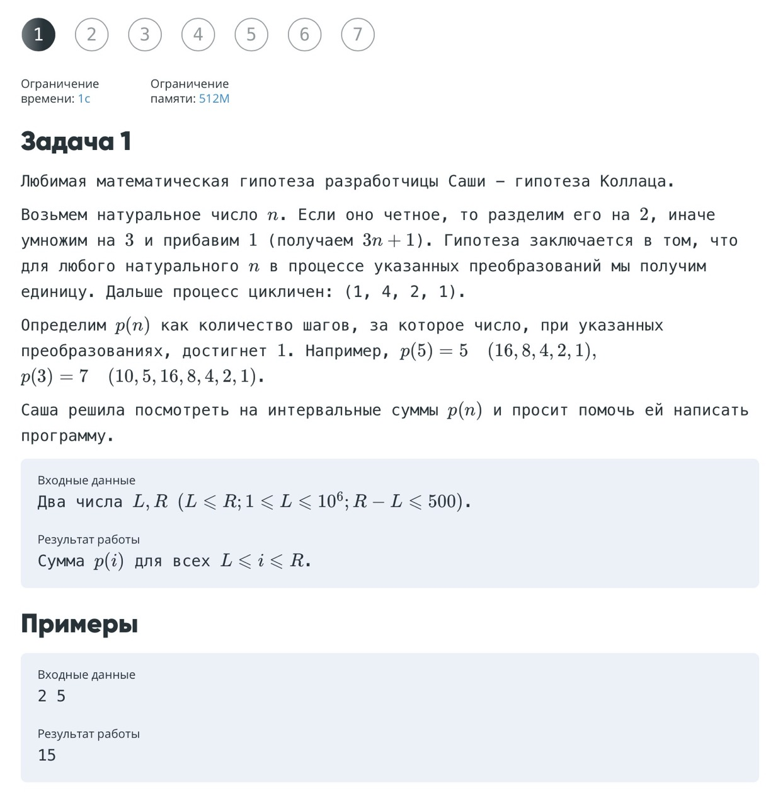
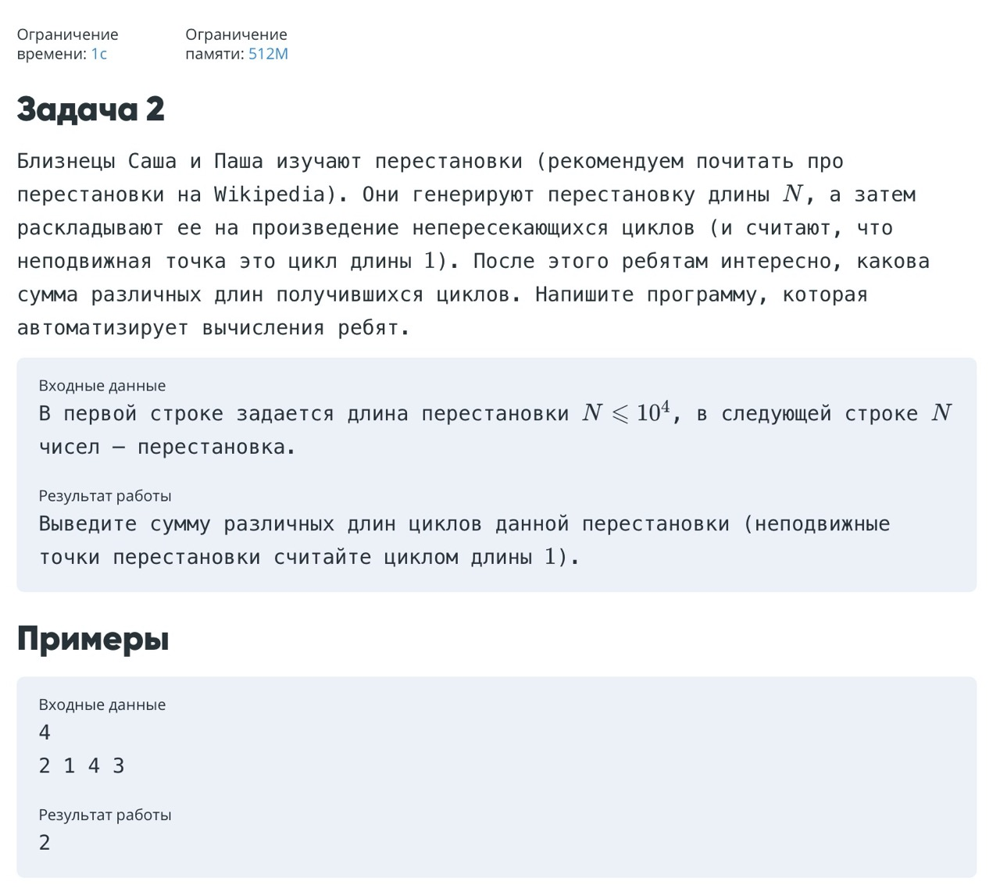
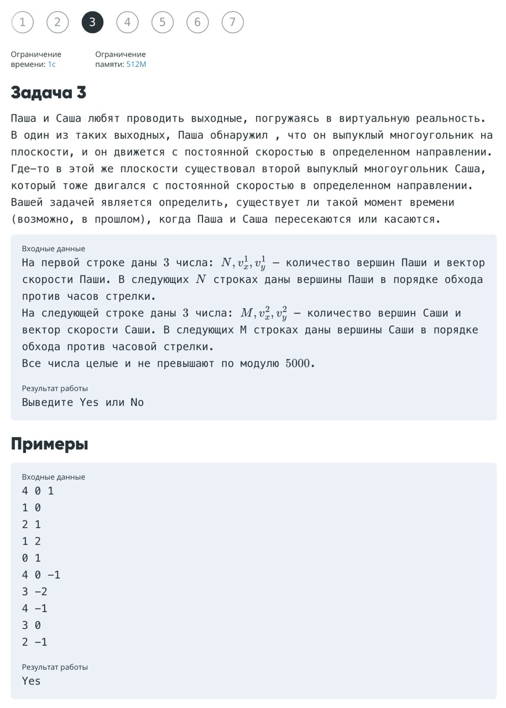
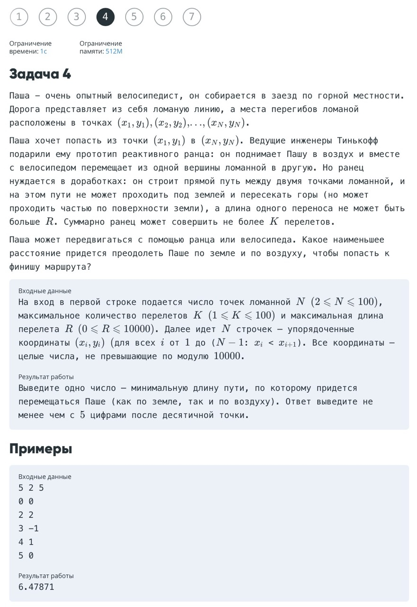
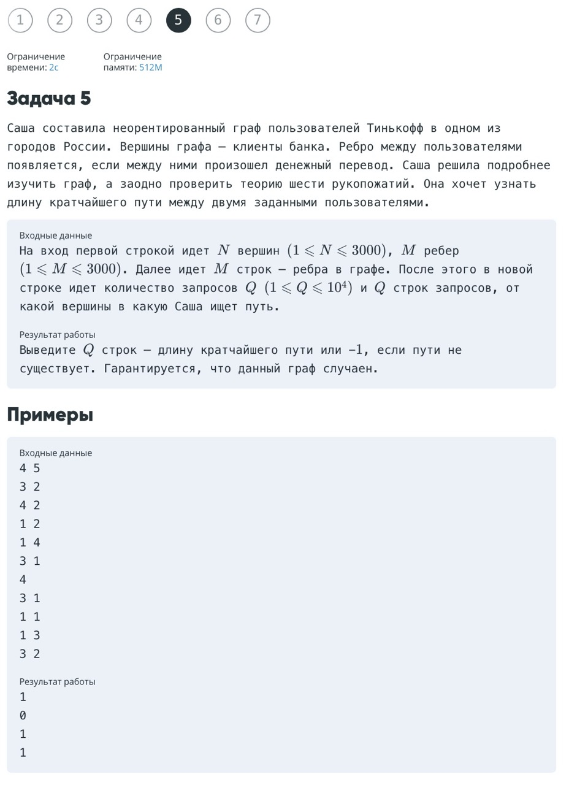
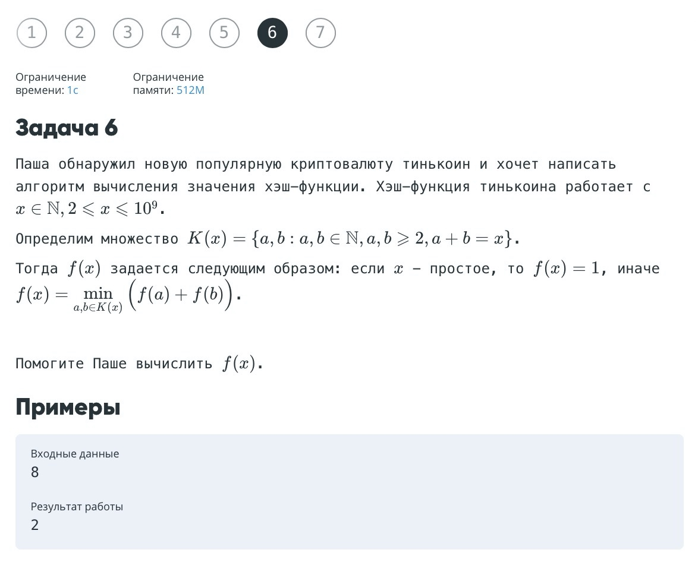
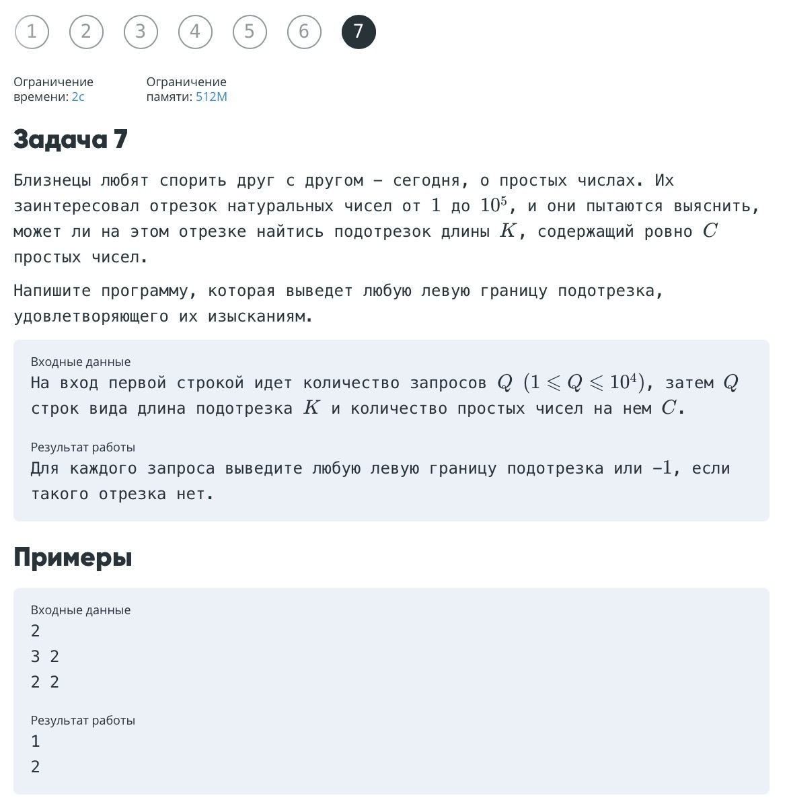

## SRE programming exam

Python3.6 was used.

Run test txt (if exists):

```bash
time (cat task3.test1.txt | python task3.py)
```


### Tasks


<details>
  <summary>Task1</summary>
  <p align="center">
    
  </p>
</details>

<details>
  <summary>Task2</summary>
  <p align="center">
    
  </p>
</details>

<details>
  <summary>Task3</summary>
  <p align="center">
    
  </p>
</details>

<details>
  <summary>Task4</summary>
  <p align="center">
    
  </p>
</details>

<details>
  <summary>Task5</summary>
  <p align="center">
    
  </p>
</details>

<details>
  <summary>Task6</summary>
  <p align="center">
    
  </p>
</details>

<details>
  <summary>Task7</summary>
  <p align="center">
    
  </p>
</details>
